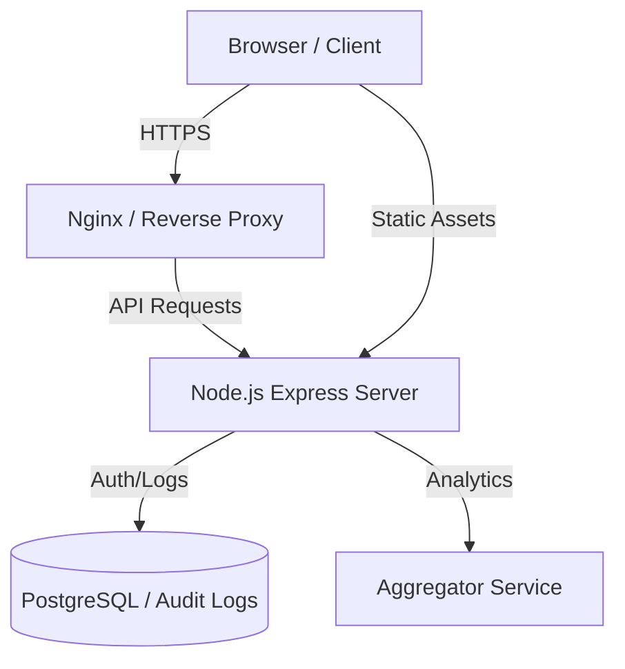
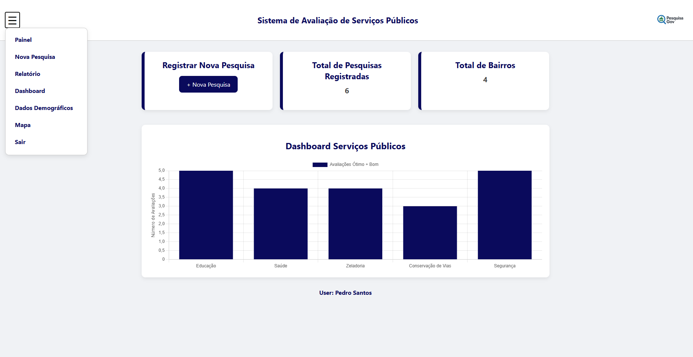
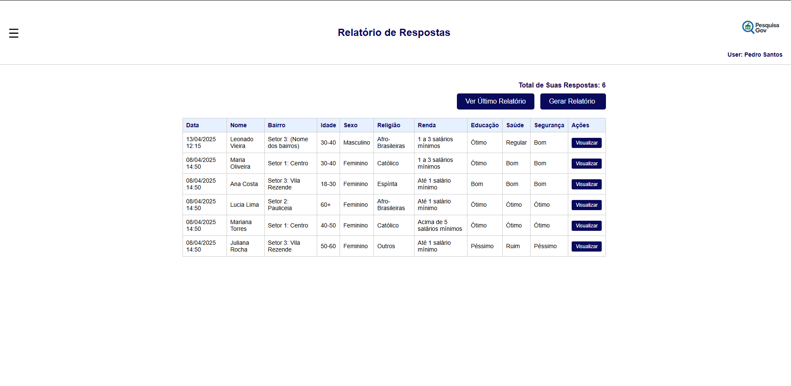
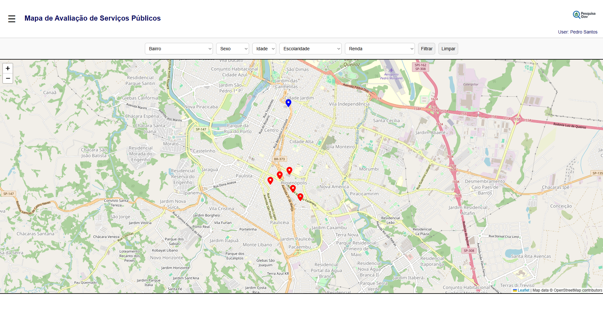
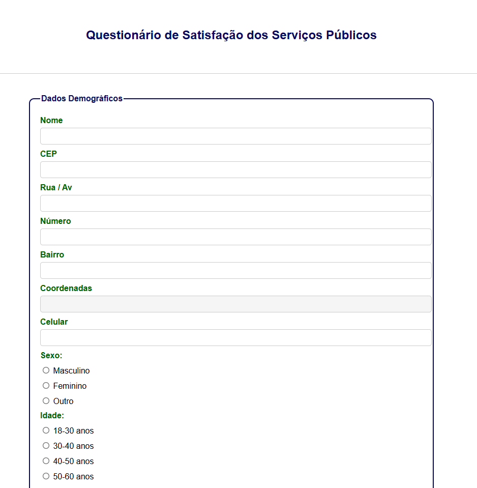

# 📊 Analytics & Audit Dashboard

> Uma plataforma de monitoramento corporativo que unifica a avaliação de serviços e a auditoria de segurança de acessos em tempo real.

## 📄 Sobre o Projeto

Este projeto foi desenvolvido para fornecer inteligência de dados (Business Intelligence) e segurança para aplicações. Ele atua em duas frentes principais: captar a avaliação de serviços e manter um log rigoroso de todas as ações realizadas na plataforma.

O foco técnico deste desenvolvimento foi criar interfaces de alta performance para a renderização de gráficos complexos e o processamento de grandes volumes de relatórios de usuários, garantindo a rastreabilidade das informações.

---

## 🏗️ Arquitetura do Sistema

O sistema segue uma arquitetura moderna de microserviços/SPA, separando a camada de apresentação da lógica de negócio.



---

## ⚙️ Como Rodar (Setup)

### 💻 Desenvolvimento Local
1. Instale as dependências:
   ```bash
   npm install
   ```
2. Inicie o servidor:
   ```bash
   npm start
   ```

---

## 🔌 Exemplos de API (Request/Response)

### 📈 Analytics Data
**GET** `/api/analytics`
- **Response (200 OK):**
```json
[
  { "service": "Serviço A", "satisfaction": 85 },
  { "service": "Serviço B", "satisfaction": 92 }
]
```

### 🛡️ Audit Logs
**GET** `/api/logs`
- **Response (200 OK):**
```json
[
  {
    "id": 1,
    "timestamp": "2024-03-20T10:00:00Z",
    "user": "admin",
    "action": "LOGIN",
    "ip": "192.168.1.1"
  }
]
```


## 📸 Galeria de Telas

| Dashboard de Avaliações | Relatórios |
|:---:|:---:|
|  |  |
| *Visualização de métricas de satisfação dos serviços.* | *Relatório operacional.* |

| Mapa Geográfico | Formulário de Auditoria |
|:---:|:---:|
|  |  |
| *Distribuição geográfica de acessos.* | *Interface de cadastro e auditoria.* |

---

## 🛠️ Stack Tecnológica

* **Backend:** Node.js, Express (Mock API para portfólio).
* **Frontend:** JavaScript Vanilla, Chart.js, HTML5/CSS3.
* **Infra:** Docker, Docker Compose.
* **CI/CD:** GitHub Actions (Build, Test, Lint).
* **Testes:** Jest, Supertest.

---
**Nota:** Este é um repositório de portfólio. O código-fonte original é de uso restrito por conter lógicas de negócio proprietárias. Esta versão demonstra a arquitetura e práticas de engenharia aplicadas.

