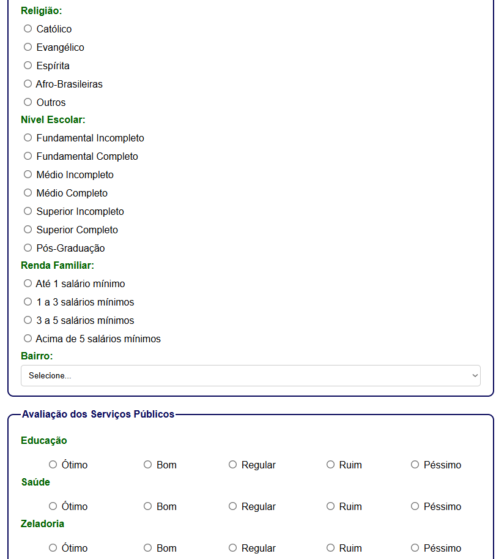
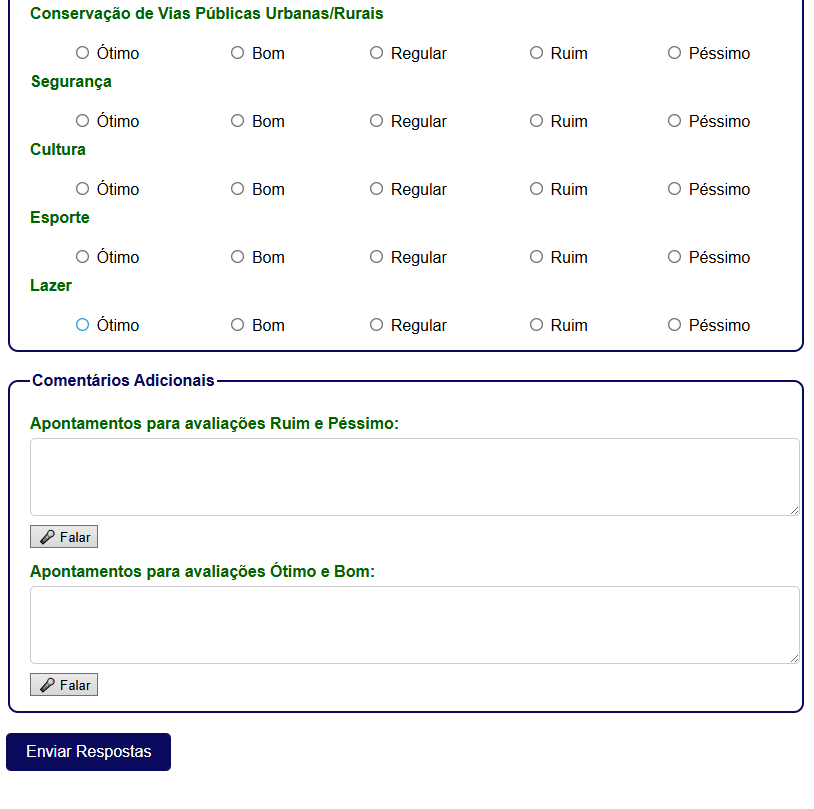

# 📊 Analytics & Audit Dashboard

> Uma plataforma de monitoramento corporativo que unifica a avaliação de serviços e a auditoria de segurança de acessos em tempo real.

## 📄 Sobre o Projeto

Este projeto foi desenvolvido para fornecer inteligência de dados (Business Intelligence) e segurança para aplicações. Ele atua em duas frentes principais: captar a avaliação de serviços e manter um log rigoroso de todas as ações realizadas na plataforma.

O foco técnico deste desenvolvimento foi criar interfaces de alta performance para a renderização de gráficos complexos e o processamento de grandes volumes de relatórios de usuários, garantindo a rastreabilidade das informações.

### 🎯 Principais Funcionalidades

* **📈 Painel de Avaliações Dinâmico:** * Renderização de gráficos em tempo real utilizando a biblioteca `Chart.js`.
    * Separação de dados por tipo de serviço avaliado e formatação automática de eixos em porcentagem (0 a 100%).
* **🛡️ Sistema de Auditoria (Logs):**
    * Rastreamento completo de ações operacionais, capturando data/hora, usuário logado, tipo de ação executada e endereço de IP.
* **⚙️ Interface de Alta Performance:**
    * Tabela de dados com injeção assíncrona e paginação gerada via JavaScript.
    * Seletor dinâmico de exibição (10, 20, 50 ou 100 registros por página) para facilitar a leitura de relatórios extensos por parte da administração.

## 🛠️ Stack Tecnológica

* **Visualização de Dados:** Chart.js para renderização de componentes analíticos visuais.
* **Manipulação de DOM:** JavaScript Vanilla para controle de paginação e injeção de dados na tabela de auditoria.
* **Interface & UI:** HTML5 semântico e CSS focado em usabilidade (utilização de FontAwesome para iconografia de rede e calendário).

---

## 📸 Galeria de Telas

| Dashboard de Avaliações | Relatórios |
|:---:|:---:|
|  |  |
| *Visualização de métricas de satisfação dos serviços.* | *Relatório.* |

| Mapa Geografico | Formulário |
|:---:|:---:|
|  |  |
| *Mapa geografico com pontos.* | *Formulário de cadastro.* |

| Formulário |
|:---:|:---:|
|  |  |
| *Formulário de cadastro.* |

---
**Nota:** Este é um repositório de portfólio. O código-fonte principal é de uso restrito por conter lógicas de negócio e regras de segurança proprietárias.
